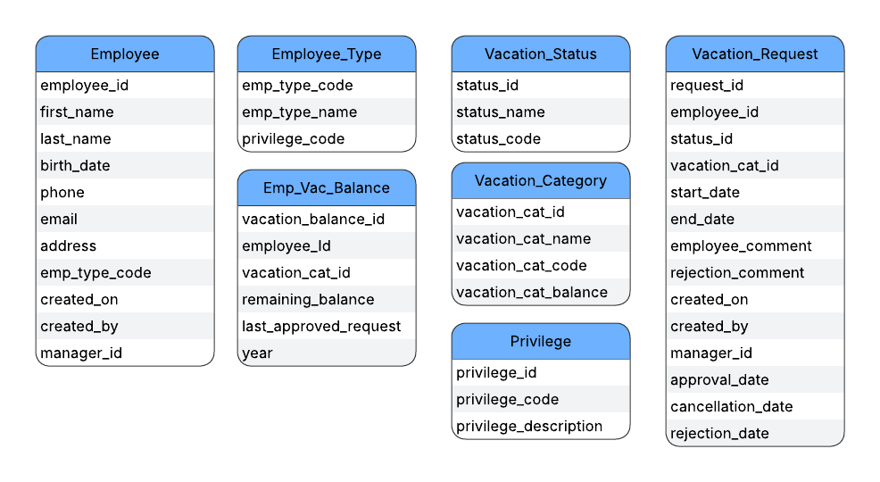
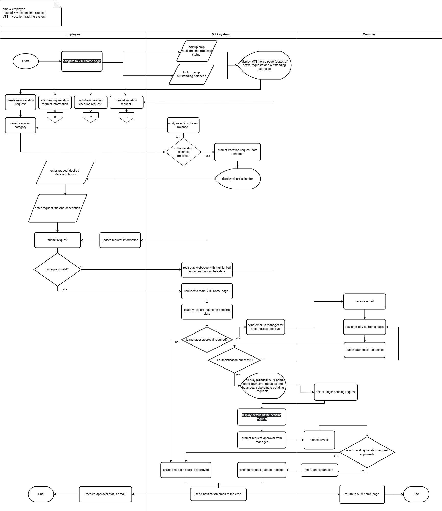
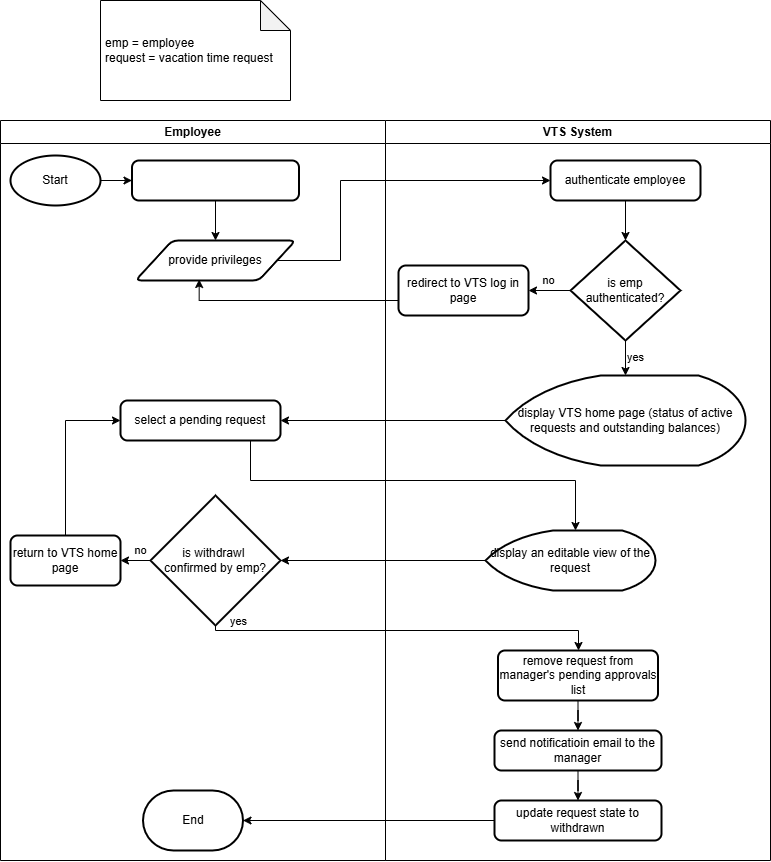
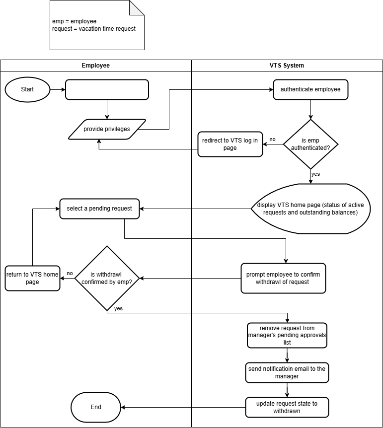
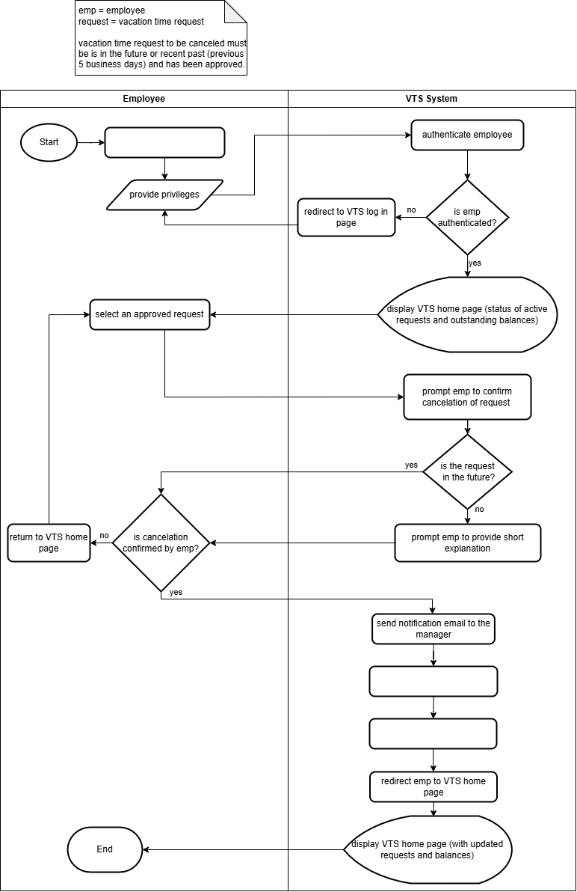
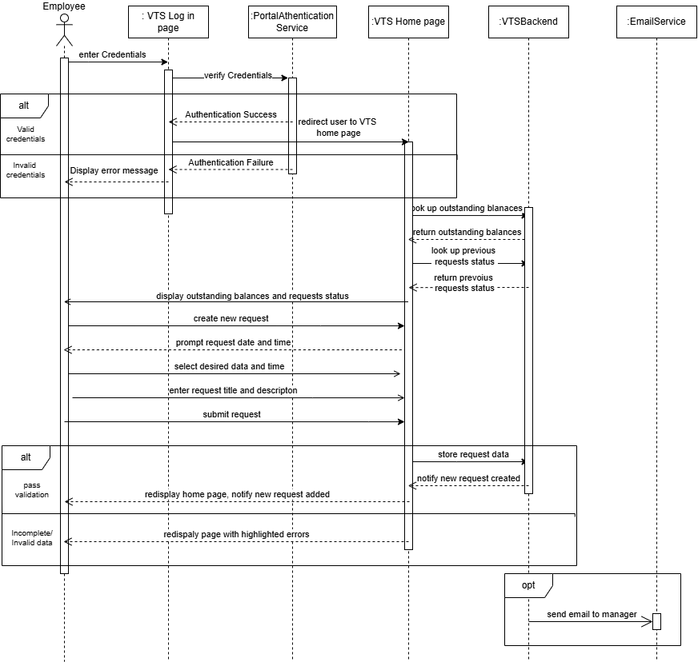
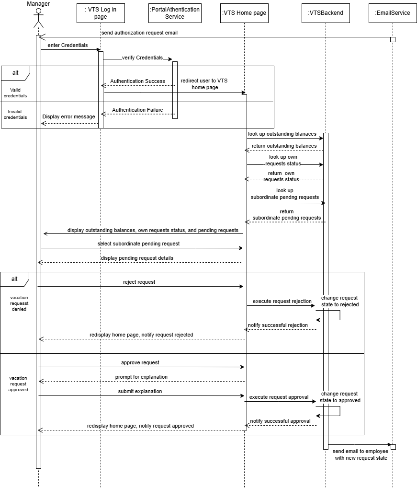

# Project Description

A dynamic Vacation Tracking System designed for multi-manager organizational structures. This system enables employees to manage their leave and time-off requests while providing managers with a centralized view to approve and monitor leaves across multiple projects.

## Vision
To improve the organization internal processes in terms of vacation management and make it faster and cost-efficient.

## Goal
A Vacation Tracking System (VTS) will provide individual employees with the capability to manage their own vacation time, sick leave, and personal time off, without having to be an expert in company policies or procedures. In addition, the automated system will assist managers to approve/deny the vacation time requests introduced by their subordinates and some high-level employees may not even require approval. The HR personnel will no longer be responsible of requesting and validating each request.

## Functional Requirements

1. Implements a flexible rules-based system for validating and verifying leave time requests.
2. Enables employees to manage their vacation time.
3. Enables manager approval (optional).
4. Provides access to requests for the previous calendar year, and allows requests to be made up to a year and a half in the future.
5. Uses e-mail notification to request manager approval and notify employees of request status changes.
6. Uses existing hardware and middleware.
7. Is implemented as an extension to the existing intranet portal system, and uses the portal's single-sign-on mechanisms for all authentication.
8. Keeps activity logs for all transactions.
9. Enables HR personnel to enter and update employee vacation data in the system.
10. Enables the HR and system administration personnel to override all actions restricted by rules, with logging of those overrides.
11. Allows managers to directly award personal leave time (with system-set limits).
12. Provides a Web service interface for other internal systems to query any given employee's vacation request summary.
13. Interfaces with the HR department legacy systems to retrieve required employee information and changes.

## Non-Functional Requirements

1. Usability: easy to use.
2. Accessiblity: the system must be acessible therough a browser.
3. Security: the system must utilize the existing intranet single-sign on capability.
4. Interoperability: the system must be able to communicate with existing legacy systems.

## Constraints

1. The system must be web-based and accessible to users via a web browser.
2. The system must be an extension to the existing portal system.
3. The system must use the existing sign-on mechanism for all authentication.

## Domain Problem
Many organizations face the problem of tracking their employees vacation time. Managers face the difficuilty of managing and monitoring their subordinates vacation time due to the limited casual interaction. Employees at the other hand need to be responsible of managing their own time-off. Moreover, organizations and large enterprieses more often have their own running systems that lack this feature. So the Vacation Tracking system must be built in consideration with the existing other systems.

## List of Actors
1. Employee.
2. Manager.
3. HR Clerk.
4. System Admin.

   
## For - Manage Time - use case
### 1. Entities (Data Model)
#### **Figure 1:** Entity Diagram showing the data model 

### 2. Flow Charts
#### **Figure 2:** Flowchart: Manage Time Use Case

#### **Figure 3:** Flowchart: Edit Pending Request

#### **Figure 4:** Flowchart: Withdraw Pending Request]

#### **Figure 5:** Flowchart: Cancel Request

### 3. Sequence Diagram
#### **Figure 6:** Sequence Diagram: Manage Time for Employee

#### **Figure 7:** Flowchart: Sequence Diagram: Manage Time for Manager

### 4. Pseudocode

```pseudocode
INPUT req_employee_id, selected_vacation_category

CONNECT TO database "VTSDatabase"

// Employee Retrieval
CREATE OBJECT Employee employee
READ FROM Employees WHERE employee_id = req_employee_id INTO employee

// Balance validation
READ FROM Vacation_Time_Balance 
WHERE employee_id = req_employee_id AND vacation_category_id = selected_vacation_category 
INTO remaining_balance_value


IF remaining_balance_value IS NOT NULL AND remaining_balance_value > 0 THEN
    
    INPUT vacation_request_start_date, vacation_request_end_date
    INPUT title, description
    
    IF validateFrToDates(vacation_request_start_date, vacation_request_end_date) = true AND
       validateTitle(title) = true AND
       validateDescription(description) = true THEN

        SET requested_days = CALCULATE_DAYS_BETWEEN(vacation_request_start_date, vacation_request_end_date)
        
        IF checkBalanceAvailability(requested_days, remaining_balance_value) = true THEN
        
            CREATE OBJECT VacationRequest vacationRequest
            
            SET vacationRequest.vacation_request_start_date = vacation_request_start_date
            SET vacationRequest.vacation_request_end_date = vacation_request_end_date
            SET vacationRequest.requested_days = requested_days
            SET vacationRequest.title = title
            SET vacationRequest.description = description
            
            IF employee.hasManager = true THEN
                SET vacationRequest.status = "pending_approval"
                CALL send_email(
                    to = employee.manager_email, 
                    subject = "Vacation Request", 
                    body = vacationRequest
                )
                OUTPUT "Request sent to manager for approval"
            ELSE
                SET vacationRequest.status = "approved"
                OUTPUT "No manager assigned. Request auto-approved."
            END IF
            
            OUTPUT "Vacation request submitted successfully"
            
        ELSE
            OUTPUT "Requested days exceed available balance"
        END IF
        
    ELSE
        OUTPUT "Incomplete or Incorrect Information"
    END IF
    
ELSE
    OUTPUT "Insufficient balance"
END IF

DISCONNECT

// Function definitions
FUNCTION checkBalanceAvailability(requested_days, available_balance)
    IF requested_days <= available_balance THEN
        RETURN true
    ELSE
        RETURN false
    END IF
END FUNCTION

FUNCTION validateFrToDates(start_date, end_date)
    IF start_date > end_date THEN
        OUTPUT "End date must be after start date"
        RETURN false
    END IF
    
    SET max_future_date = CURRENT_DATE + 18 MONTHS

    IF end_date > max_future_date THEN
        OUTPUT "Requests cannot exceed 18 months in the future"
        RETURN false
    END IF

   SET min_past_date = CURRENT_DATE - 6 MONTHS

    IF start_date < min_past_date THEN
        OUTPUT "Requests cannot be before 6 months in the past"
        RETURN false
    END IF 
    RETURN true
END FUNCTION
DISCONNECT
```
