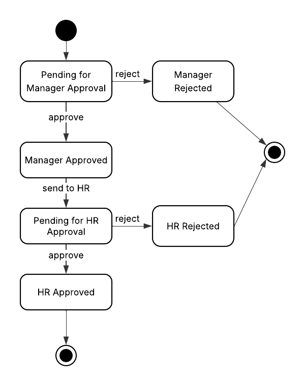
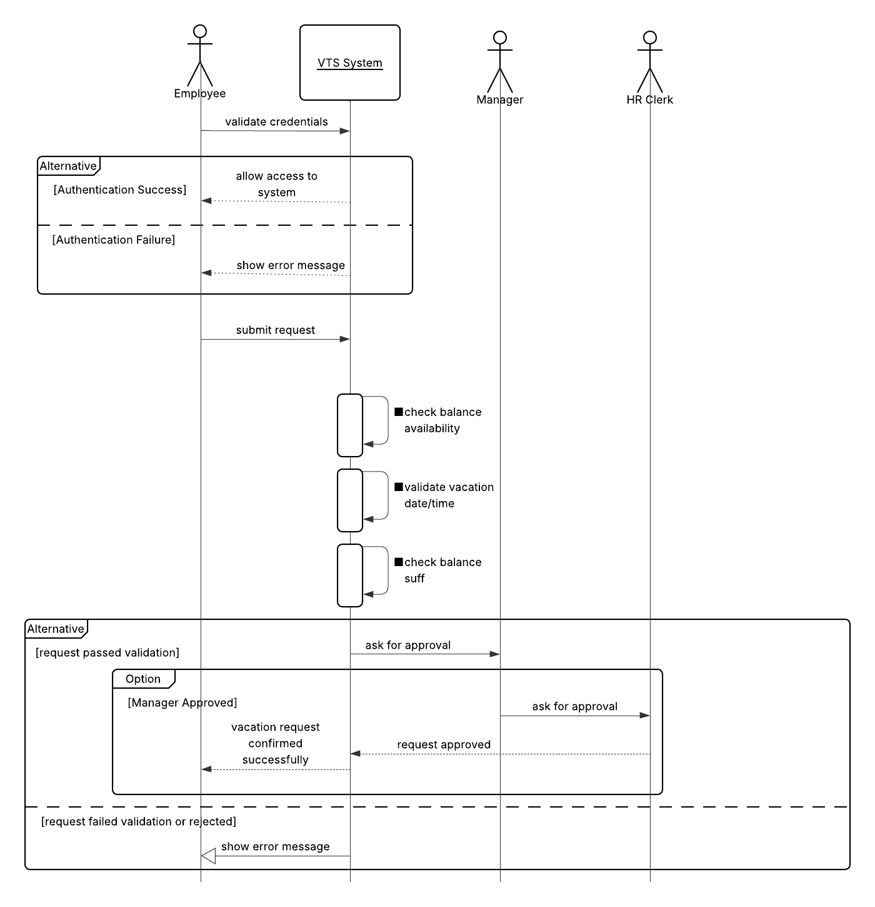

**Q1: Imagine the UI of Requests displayed to the Manager or Employee. What if we need to have in the future another status like HR_Pending, HR_Approval with minimum change?**

**A1: To ensure the UI for Managers and Employees can accomadate the new statueses with minimal code change, we can imporve the exisitng database architecture. According to the database design, there is a table called Vacation_Status. The table holds data about the different statuses of a vacation request. We can utilize this table to modifiy the application logic. The HR_Pending and HR_Approval statuses can be added to the Vacation_Status table. A column called Status_Sequnce is responsible of defining the progression of the request status. By updating the next_status_sequence values, we can determine the order of operations ensuring which status follows the other one.**

**Q2: Write the pseudo-code for the two cases above**

**A2:** 
```pseudocode


CONNECT TO database "VTSDatabase"
// Function definitions

//retreive Next Request Status: to ensure there is a correct request progression accross all stages
Function retriveNextStep (Vacation_Request vacation_request)
  READ FROM Vacation_Status
  WHERE status_id = vacation_request.status_id INTO next_status_sequence
  SET vacation_request.status_id = next_status_sequence
  READ FROM Vacation_Status
  WHERE status_id = next_status_sequence INTO newStatus
  IF newStatus.status_code ="Approved" THEN
    output("Vacation Request successfully approved");
  ELSE
    output("Vacation Request waiting approval" + newStatus.statusName);
  END IF
  return vacation_request
  // return the vacation request object with the status_id updated
END FUNCTION
  
//check if the employee has enough balance to be granted the requested vacation days
FUNCTION checkBalanceAvailability(requested_days, available_balance)
    IF requested_days <= available_balance THEN
        RETURN true
    ELSE
        RETURN false
    END IF
END FUNCTION

//validate entered dates
FUNCTION validateFrToDates(start_date, end_date)
    IF start_date > end_date THEN
        OUTPUT "End date must be after start date"
        RETURN false
    END IF
    
    SET max_future_date = CURRENT_DATE + 18 MONTHS

    IF end_date > max_future_date THEN
        OUTPUT "Requests cannot exceed 18 months in the future"
        RETURN false
    END IF

   SET min_past_date = CURRENT_DATE - 6 MONTHS

    IF start_date < min_past_date THEN
        OUTPUT "Requests cannot be before 6 months in the past"
        RETURN false
    END IF 
    RETURN true
END FUNCTION
//Start of the process flow
INPUT req_employee_id, selected_vacation_category
// Employee Retrieval
CREATE OBJECT Employee employee
READ FROM Employees WHERE employee_id = req_employee_id INTO Wmployee employee

// Balance validation
READ FROM Vacation_Time_Balance 
WHERE employee_id = req_employee_id AND vacation_category_id = selected_vacation_category 
INTO remaining_balance_value


IF remaining_balance_value IS NOT NULL AND remaining_balance_value > 0 THEN
    
    INPUT vacation_request_start_date, vacation_request_end_date
    INPUT title, description
    
    IF validateFrToDates(vacation_request_start_date, vacation_request_end_date) = true AND
       validateTitle(title) = true AND
       validateDescription(description) = true THEN

        SET requested_days = CALCULATE_DAYS_BETWEEN(vacation_request_start_date, vacation_request_end_date)
        
        IF checkBalanceAvailability(requested_days, remaining_balance_value) = true THEN
        
            CREATE OBJECT VacationRequest vacationRequest
            
            SET vacationRequest.vacation_request_start_date = vacation_request_start_date
            SET vacationRequest.vacation_request_end_date = vacation_request_end_date
            SET vacationRequest.requested_days = requested_days
            SET vacationRequest.title = title
            SET vacationRequest.description = description
             IF employee.hasManager = true THEN
                SET vacationRequest.status = "Manager_Pending_Approval"
                CALL send_email(
                    to = employee.manager_email, 
                    subject = "Vacation Request", 
                    body = vacationRequest
                )
                OUTPUT "Request sent to manager for approval"
                ELSE
                SET vacationRequest.status = "HR_Pending_Approval"
                OUTPUT "Request sent to HR for approval"
            END IF            
        ELSE
            OUTPUT "Requested days exceed available balance"
        END IF
        
    ELSE
        OUTPUT "Incomplete or Incorrect Information"
    END IF
    
ELSE
    OUTPUT "Insufficient balance"
END IF

DISCONNECT


DISCONNECT
```
**Q3: Draw the state machine of the request. [ch5]**

**A3:**

**Figure 1: State Machine Diagram**



**Q4: Draw the sequence diagram of the request. [ch5]**

**A4:**

**Figure 2: Sequence Diagram**




**Q5: Complete the rest of the use-case of this chapter [Cancel - Edit Pending Request] Flowchart, sequence diagram - check database change**

